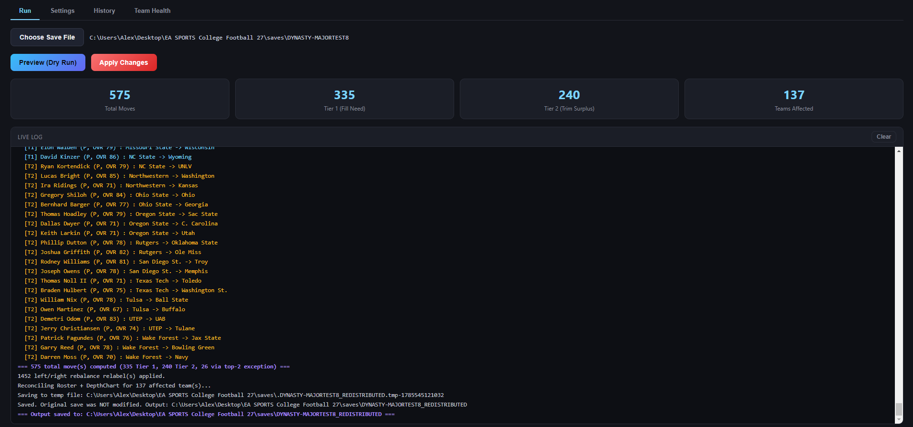
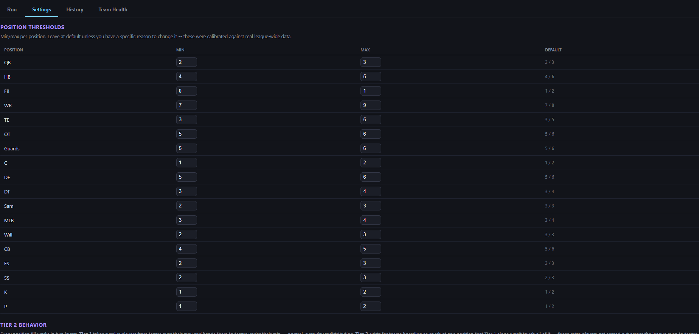
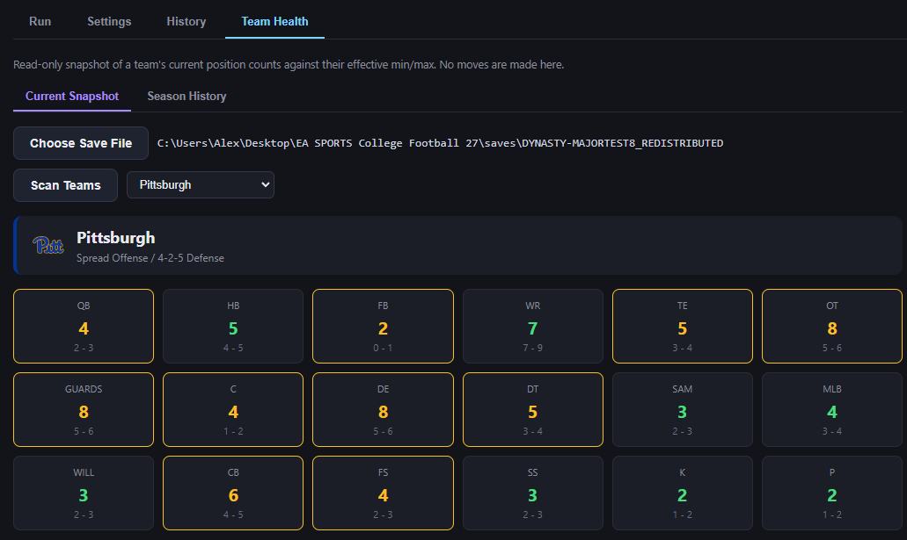
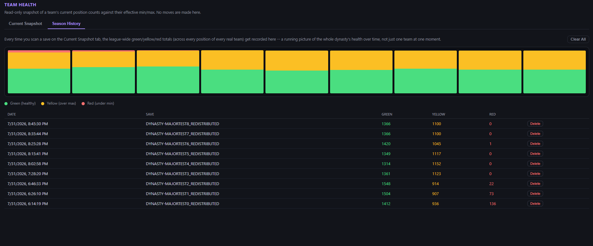
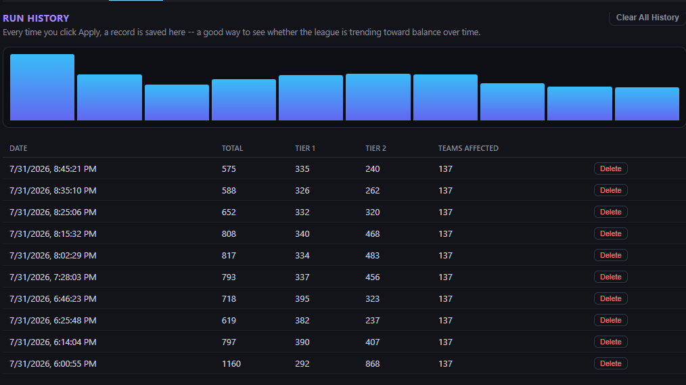

# Preseason Transfer Wave

A tool that fixes CPU team rosters in EA Sports College Football 27 dynasties.

The CPU doesn't manage its own rosters well. Some teams end up with way too many players at one position (14 running backs) while other teams end up with almost none (0 punters). This tool looks at every CPU team's roster, finds those problems, and moves players around to fix them — before each new season starts.

It never touches your own team. Every Apply run backs up your original save first, then updates that save in place — so there's always a fallback, without leaving you a pile of separate output files to manage. **The Run tab checks your league for roster drift automatically when you choose a save, so you know whether it's actually worth running this preseason before you commit to anything.**

## Screenshots

**Run tab, mid-run** — live log with Tier 1/Tier 2 moves, summary cards once done.

**Settings tab** — every position's min/max, editable, with the defaults shown alongside for comparison.

**Team Health, Current Snapshot** — one team's position counts against their effective min/max.

**Team Health, Season History** — league-wide green/yellow/red totals over time.

**History tab** — every past Apply run, with totals and a delete option per entry.

---

## Table of Contents

- [What it does](#what-it-does)
- [Installation](#installation)
- [Quick start](#quick-start)
- [The Run tab](#the-run-tab)
- [The Settings tab](#the-settings-tab)
- [The History tab](#the-history-tab)
- [The Team Health tab](#the-team-health-tab)
- [How it decides who moves](#how-it-decides-who-moves)
- [Locked threshold table](#locked-threshold-table)
- [Scheme awareness](#scheme-awareness)
- [Safety design](#safety-design)
- [Known limitations](#known-limitations)
- [Changelog](#changelog)

---

## What it does

Every position has a normal range of how many players a team should have. QBs, for example, should be somewhere between 2 and 3. If a team has way more than that, some of those extra players get moved to a team that doesn't have enough.

Step by step, each time you run it:

1. It reads every real CPU team's roster (skips your own team, skips fake scheduling-only entries like "FCS East").
2. It compares each team's count at each position against the normal range for that position.
3. Teams over the range are donors. Teams under the range are recipients.
4. It picks which specific players move — bench players who aren't starters and aren't next in line to start, worst players first.
5. It matches donors to recipients so the extra players get spread across many different teams instead of all going to one team.
6. If a team is *way* over the range (not just a little), some of that extra gets moved out even if no other team currently needs it. This is capped so a bad team doesn't just get handed players from a great team — with one exception: a real talent upgrade is still allowed through.
7. It saves everything correctly — not just "who's on what team," but also depth charts, left/right O-line balance, and NIL values.

You don't need to run this every single preseason. Choosing a save on the Run tab automatically scans the league for roster drift and tells you what it finds — teams way over or under normal at a position. Only run the tool when that scan actually flags something worth fixing.

## Installation

Download the release, unzip it wherever you like, and double-click `Preseason Transfer Wave.exe`. That's it — no Node.js, no npm, nothing else to install.

## Quick start

1. Go to the **Run** tab, click **Choose Save File**, and pick your dynasty save.
2. Click **Preview (Dry Run)** first. This shows you everything it *would* do, without actually changing anything.
3. If it looks right, click **Apply Changes**. This backs up your original save to a `Preseason Transfer Backup` folder next to it, then overwrites the save itself with the changes.
4. Load your save in-game like you normally would — it's already updated in place.

## The Run tab

- **Choose Save File** — pick your save. This kicks off an automatic drift scan across every CPU team, then a prompt asking whether this dynasty is in the preseason. The scan results show up in that same prompt, grouped by which teams are actually deficient and why (surplus doesn't count toward this at all, and neither does FB) — either "no major drift detected" or a list of specific teams and what they're short on. Once enough non-FB shortages show up league-wide (configurable in Settings, default 10), it actively recommends running the tool rather than just listing what it found. Answering "No" to the preseason question locks Preview/Apply until you pick a save and confirm again.
- **Preview (Dry Run)** — shows what would happen. Changes nothing.
- **Apply Changes** — actually makes the moves and overwrites your save in place. A backup of the original is made first, saved to a `Preseason Transfer Backup` folder next to your save, along with a full text copy of this run's Live Log saved right alongside it. Asks you to confirm first.
- **Live Log** — shows each move as it happens. `[T1]` means a normal move (filling real need). `[T2]` means a forced move (a team had way too many players at that spot).
- **Summary cards** — totals once it's done: how many moves, how many were T1 vs T2, how many teams were touched.

## The Settings tab

- **Position Thresholds** — the normal min/max range for every position, plus that position's own Severe Donor Threshold (see Tier 2 Behavior below). You can change any of them. The defaults were set by looking at real numbers across a whole league, not guessed. Grouped into three collapsible sections — Offense, Defense, Special Teams — so the list doesn't run on forever if you're not touching most of it.
- **Tier 2 Behavior** — a switch to turn the "forced move" behavior on or off, plus:
  - **Severe donor threshold** — how far over the max a team has to be before it counts as a "forced move" situation. Set per position/group up in the Position Thresholds table above, not as one general rule — tune each one for your own dynasty. FB/K/P default to 0 instead of 2 since their tiny natural ranges mean the general default would almost never trigger for them, but every position (including those three) can be adjusted individually.
  - **Prestige gap cap** — stops a bad team's leftover player from jumping straight to a great team, unless that player is actually good enough to be one of the best at that position on the new team.
  - **Max Tier 2 players any one team can absorb per position, per run** — default 1. Without this, a rare low-prestige team that happens to be the only eligible recipient for a big backlog can absorb dozens of forced-dump players in a single Apply. A capped-out candidate is left unassigned for that run instead, spreading a large backlog across several preseasons rather than dumping it all at once.
- **Other Options**:
  - **Drift warning threshold (non-FB shortages)** — how many positions have to show a real shortage league-wide before the automatic drift check (see the Run tab) actively recommends running the tool. Default 10 — a starting point, not a calibrated number the way the position thresholds themselves are.
  - A checkbox to zero out a moved player's NIL value. We don't actually know if this changes anything about how the CPU treats the player — it's just a reasonable guess, so it's optional instead of forced on.
- **Playbook Awareness** — explains how a team's real offense/defense playbook shifts some of the numbers automatically. You don't set this yourself; it just happens based on real data.

Settings are saved and used every time you run the tool.

## The History tab

Every time you click **Apply**, it saves a record here — date, total moves, how many were T1 vs T2, how many teams were touched. Shown as a chart and a table. You can delete any single entry or clear everything.

Each entry also has a **Details** toggle that expands two mini breakdowns for that run: how many players moved at each position, and how many fell into each overall-rating range (below 60, 60–70, 70–80, 80+). The rating-range breakdown only exists for runs made after this feature shipped — older entries show a note instead of guessing.

## The Team Health tab

Three tabs inside this tab:

- **Current Snapshot** — pick a save (separate from whatever's picked on the Run tab) and scan it. Shows every team's count at every position, colored green (fine), yellow (over the max), or red (under the min). Shows the team's logo, colors, and real playbook too.
- **Season History** — every time you scan, it saves the league-wide green/yellow/red totals as one entry in a chart, so you can watch the whole league's health over your whole dynasty. Hover over the red part of any bar to see exactly which positions are causing it (like "12-FB, 6-Sam, 4-P"). Your own team is left out of these totals on purpose, since this tool is about CPU teams, not you.
- **Roster** — pick a save and a team, see its full current roster in the game's own position order and labels (RB, LEDG/REDG, SAM/MIKE/WILL, etc.). If you just made a real Apply run this session on this same save, arrivals get a green "NEW" badge and a separate "Recently Departed" list shows anyone who just left, and where. This is a live, in-session check-in against the run you just made — it resets when you restart the app, since it's meant to answer "did this run just do what I expected," not serve as a permanent log (the run log saved to the backup folder covers that instead).

## How it decides who moves

**Picking who's expendable on a donor team:**
1. Starters never move.
2. A backup who's about to inherit a starting job (because the guy ahead of them is a graduating senior) never moves.
3. Everyone else: players buried deepest on the bench go first, then by class year (older players before younger, to protect younger players' development time), then lowest overall rating as the final tiebreaker.

**Matching donors to recipients:** the most in-need team gets the most expendable player first, then the next most in-need team gets the next player, and so on — spreading things out instead of dumping everything on one team.

**Forced moves (Tier 2):** only for teams that are way, way over the max — more than a normal correction. Their extra players get spread to teams that aren't already over the max, picked randomly each time so it's not always the same teams receiving them, and capped by the prestige rule mentioned above.

**Left/right line balance:** after moves are made, tackles and guards get sorted so the better players go on the correct side based on the team's starting QB — right-handed QB means the left side gets the better players, left-handed QB flips it. Defensive ends don't have a "better side," so they just alternate evenly.

## Locked threshold table

| Position | Min | Max |
|---|---|---|
| QB | 2 | 3 |
| HB | 4 | 6 |
| FB | 1 | 2 |
| WR | 7 | 8 |
| TE | 3 | 5 |
| OT (LT+RT) | 5 | 6 |
| Guards (LG+RG) | 5 | 6 |
| C | 1 | 2 |
| DE (LE+RE) | 5 | 6 |
| DT | 3 | 4 |
| Sam (LOLB) | 3 | 3 |
| MLB | 3 | 4 |
| Will (ROLB) | 3 | 3 |
| CB | 5 | 6 |
| FS | 2 | 3 |
| SS | 2 | 3 |
| K | 1 | 2 |
| P | 1 | 2 |

These numbers came from checking real save files, not guesses. **FB is the one position that can't fully be fixed** — real football just doesn't have enough true fullbacks for the game's own demand, and moving players around can't create more of something that doesn't exist. Every other position was checked to make sure there's actually enough supply league-wide to fix every team.

## Scheme awareness

A team's real offense/defense shifts some max numbers automatically:

- **Air Raid / Run and Shoot / Veer and Shoot / Spread** (pass-heavy): more WRs allowed, fewer TEs, and FB min drops to 0 with max reduced by 1 -- these teams realistically play with often no true fullback at all.
- **Power Spread / Spread Option / Pistol / Option** (run-heavy): more HBs allowed, fewer WRs, and FB can go one over the normal max with a minimum of at least 1 guaranteed -- these schemes lean on an extra fullback more than a typical offense and always expect a real one.
- **Base 3-4 / 3-4 Multiple / 3-3-5 / 3-3-5 Tite / 3-2-6** (3-down fronts): fewer DTs, more Sam/MLB/Will.
- **3-3-5 / 3-3-5 Tite / 3-2-6** specifically: more CB/FS/SS.
- **Base 4-3 / 4-2-5 / 4-3 Multiple** and **Pro Style / West Coast Zone Run / Multiple Offense**: no change — this is the normal baseline everything else is measured against.

## Safety design

- **Your original save is always backed up before it's touched.** Every Apply run copies the original to a timestamped file in a `Preseason Transfer Backup` folder next to the save, then overwrites the save itself.
- **Saves are written safely** (write to a temp file, then rename it) so a crash or interruption mid-save can't corrupt anything, including if your save is in a cloud-synced folder like OneDrive.
- **Your own team is found using a specific save field (`Team.UserCharacter`)**, not the coach's own team field, because that one can get stuck pointing at an old team after you switch jobs. Tested on real saves, including after actually switching coaching jobs, and it correctly handles multiple human-controlled teams in the same online dynasty too.
- **Every move updates the actual roster/depth chart data**, not just "who's on what team" — a tool that only changes the second thing will look right in a spreadsheet but wrong in the game.

## Known limitations

- **FB can't be fully fixed** — see the table note above.
- **Your own team's numbers were occasionally wrong before v1.1.0** because of a game-data quirk (confirmed on real saves: players and even entire coaching staffs can carry a stale internal team reference, most visibly after switching coaching jobs). The switch to reading each team's authoritative `Roster` array — and excluding any player not found in one, rather than trusting a possibly-stale reference — fixes this for counting purposes going forward. Your own team is still left out of the Season History totals as a precaution, since we can't rule out every possible variation of this game-data behavior with certainty.
- **Needs a specific version of the `madden-franchise` library** (loaded a slightly unusual way) because the version needed for CFB 27's current patch wasn't available the normal way at the time this was built.
- **Backups aren't automatically cleaned up.** Every Apply run adds one more file to `Preseason Transfer Backup` — over a full dynasty that's a few dozen files, and it's on you to delete old ones if you want to reclaim the space.

## Changelog

### v1.1.0

- **Core counting logic now reads from each team's authoritative `Roster` array, not `Player.TeamIndex`.** Confirmed across multiple real saves that `Player.TeamIndex` can be stale — a handful of real teams can carry `TeamIndex` pointing at a team's own roster showing zero players while a completely normal roster sits in their `Roster` array, and the human-controlled team specifically could accumulate phantom `TeamIndex` references from players who weren't really on that roster at all. Every donor/recipient decision, Team Health count, and Tier 2 candidate check now resolves membership the same way the game itself renders rosters, not through a foreign-key field that can drift. Players not found in any real team's `Roster` array are excluded from every count entirely rather than guessed at.
- **New Roster tab** (under Team Health) — pick a save and a team, see its full current roster in the game's own depth-chart order and labels (RB, LEDG/REDG, SAM/MIKE/WILL, etc.), with a green "NEW" badge on anyone who just arrived and a separate "Recently Departed" list for anyone who just left — a live, in-session check-in against the run you just made, not a permanent log.
- **Every real Apply run now saves its full Live Log to a `.txt` file** in the `Preseason Transfer Backup` folder, named to match that run's backup exactly — a durable record of exactly what moved, to check against what actually shows up in-game afterward.
- **Drift check redesign** — surplus no longer counts toward anything; only genuine shortages drive the recommendation now, and FB is excluded from that count entirely (it's already documented as unfixable, so it would otherwise trigger the warning in every league regardless of real health). The detail view is grouped by team ("which teams are actually deficient, and why") instead of a flat list of position rows. The threshold for when the check actively recommends running the tool is now configurable in Settings (**Drift warning threshold**, default 10).
- **Tier 2 recipient cap** — new Settings control, **max Tier 2 players any one team can absorb per position, per run** (default 1). Without this, a rare low-prestige team could end up as the *only* eligible recipient for a large backlog of forced-dump candidates and absorb dozens of them in a single Apply (confirmed on a real save: two small programs absorbed 40+ quarterbacks between them in one run). A capped-out candidate is simply left unassigned for that run instead — a big backlog spreads across several preseasons rather than landing all at once.
- **Tier 2 log lines now show the actual reason for every match** — the real prestige gap, both teams' prestige, and whether it went through via the top-2 talent exception — instead of just announcing that a move happened.
- **Stress-tested against mid-dynasty conference realignment and repeated coaching changes** on a real save, specifically because those are the two conditions most likely to disturb team identity. Team row position, each team's own `TeamIndex` field, and coach-to-team correctness all held up cleanly through both.

### v1.0.2

- **Automatic drift check** — choosing a save on the Run tab now scans every CPU team's roster right away and flags anything that's drifted badly (teams way under min or way over max at a position), shown right in the preseason confirmation prompt. The point is to tell you whether running the tool this preseason is actually worth it, instead of assuming you should run it every time.
- **Backup + overwrite instead of a new file** — Apply now backs up your original save to a `Preseason Transfer Backup` folder next to it, then overwrites the save in place, rather than producing a separate `_REDISTRIBUTED` file each time. History entries and the Apply confirmation dialog were updated to match.

### v1.0.1

- **Per-position Severe Donor Threshold** — replaces the old two-scalar setting (one general number, one FB/K/P-specific number). Every position/group in the Position Thresholds table now has its own tunable Severe Donor Threshold, so you can dial in Tier 2 behavior individually instead of by a hardcoded FB/K/P special case.
- **Collapsible Position Thresholds groups** — the table is now split into three collapsible sections (Offense, Defense, Special Teams) so Settings doesn't run on forever if you're not touching most of it.
- **Preseason confirmation prompt** — choosing a save file on the Run tab now asks whether the dynasty is actually in the preseason. Answering "No" locks Preview/Apply until you pick a save and confirm again.
- **History tab breakdowns** — each run now has a **Details** toggle showing moves by position and moves by overall-rating range (below 60, 60–70, 70–80, 80+). The rating-range breakdown only applies to runs made after this update; older entries note that it isn't available.

### v1.0.0

- Initial public release.
